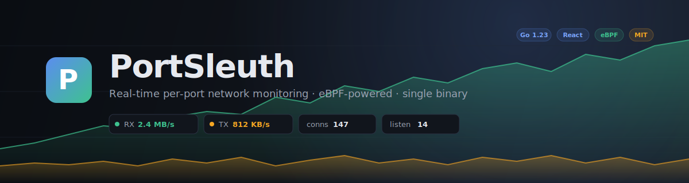
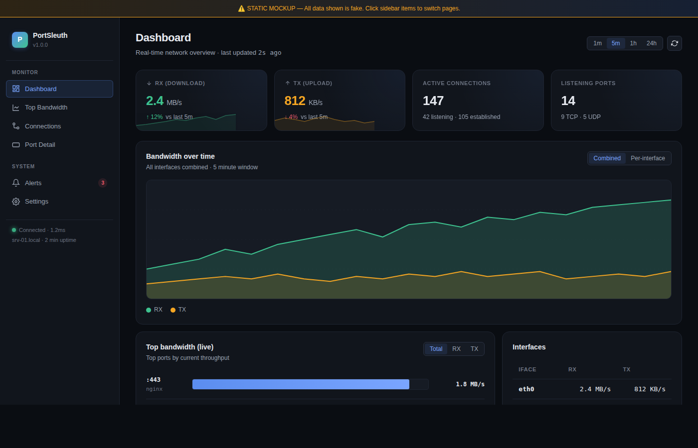
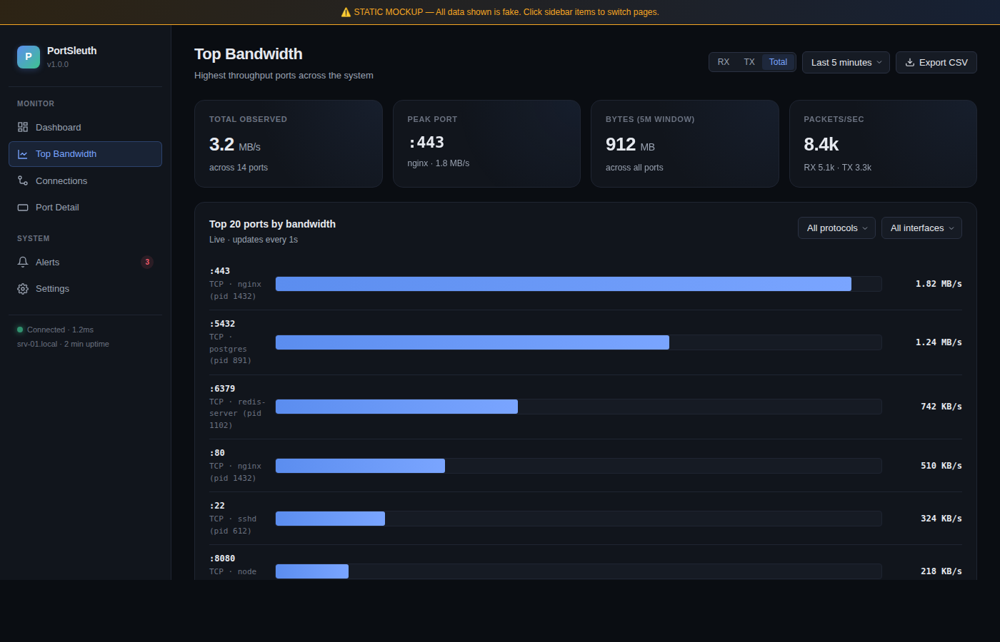
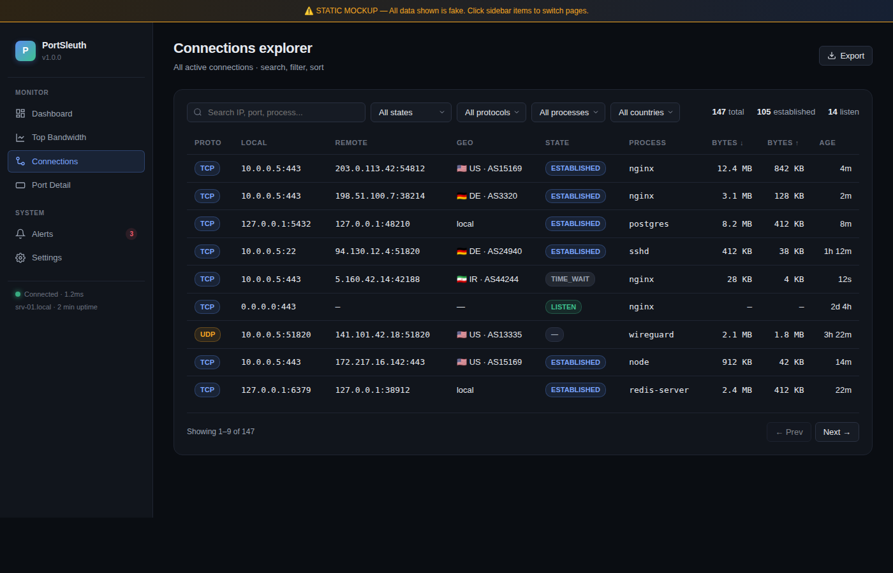
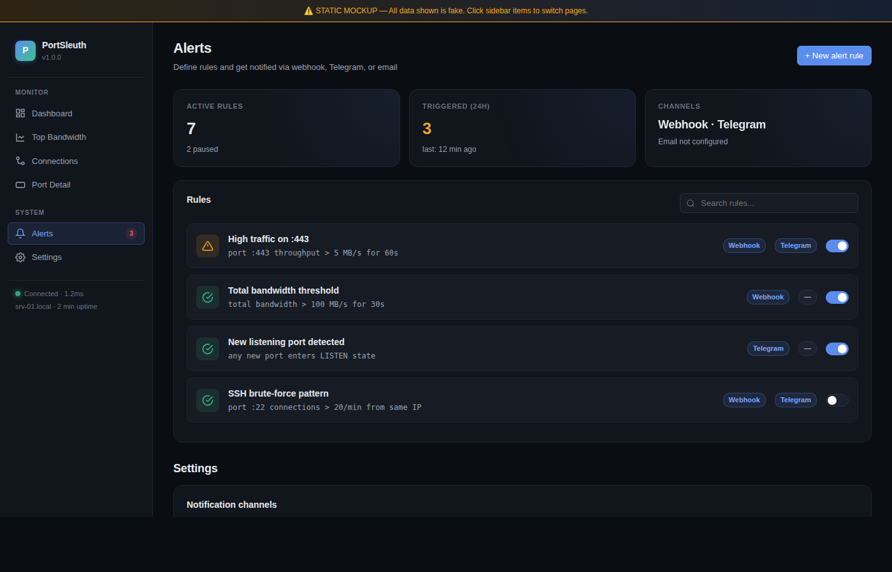

<div align="center">



# PortSleuth

**Lightweight network & port monitoring for Linux servers.**
Real-time per-port bandwidth, connection inventory, alerts, and a fast web UI — all in a single Go binary.

[](https://opensource.org/licenses/MIT)
[](https://go.dev/)
[](https://react.dev/)
[](https://ebpf.io/)
[](https://ubuntu.com/)

</div>

---

## ✨ One-line install

Run this on your Ubuntu 24 server (works as `root` or with `sudo`):

```bash
curl -fsSL https://raw.githubusercontent.com/TheMojtabam/networkmonitor/main/install/build-and-run.sh | sudo bash -s -- PORT=8080
```

That's it. The script:

1. installs Go, Node.js, clang and other build deps
2. clones this repo
3. builds the Go backend (with real eBPF when possible, automatic fallback otherwise)
4. builds the React frontend and embeds it into the binary
5. installs as a `systemd` service and starts it
6. prints your URL when it's done

Open `http://<server-ip>:8080` in your browser.

### With authentication

```bash
curl -fsSL https://raw.githubusercontent.com/TheMojtabam/networkmonitor/main/install/build-and-run.sh \
  | sudo bash -s -- PORT=8080 AUTH_ENABLED=true ADMIN_PASS='YourStrongPassword'
```

### Pick a different port

```bash
curl -fsSL https://raw.githubusercontent.com/TheMojtabam/networkmonitor/main/install/build-and-run.sh \
  | sudo bash -s -- PORT=9999
```

> [!TIP]
> Behind a corporate firewall? Set `GOPROXY` to bypass blocked proxies:
> ```bash
> curl -fsSL .../build-and-run.sh | sudo bash -s -- PORT=8080 GOPROXY='https://goproxy.cn,direct'
> ```

---

## 📸 Screenshots

<details open>
<summary><b>Dashboard</b> — live overview with stat cards, sparklines, and a 5-minute bandwidth chart</summary>



</details>

<details>
<summary><b>Top Bandwidth</b> — top-N ports ranked by current throughput, with filters and CSV export</summary>



</details>

<details>
<summary><b>Connections explorer</b> — every active TCP/UDP flow, searchable, with GeoIP enrichment</summary>



</details>

<details>
<summary><b>Alerts</b> — define rules, get notified via webhook or Telegram</summary>



</details>

---

## 🎯 Features

- **Per-port bandwidth, accurately.** A small XDP eBPF program counts bytes per `(port, proto, direction)` tuple. No `tcpdump`, no overhead, no missed packets. When eBPF isn't available, falls back to `ss -i` parsing automatically.
- **Process attribution.** Every listening port and connection is mapped to its owning process via `/proc/[pid]/fd/socket:[inode]` lookups.
- **Real-time updates.** A WebSocket pushes a fresh snapshot every second — no polling, no lag.
- **Time-series history.** In-memory ring buffer for high-resolution recent data, optional SQLite for long-term retention.
- **GeoIP-enriched connections.** Optional MaxMind GeoLite2 lookups annotate remote IPs with country and ASN.
- **Alert engine.** YAML-defined rules (port bandwidth, total throughput, connection count) with webhook + Telegram delivery.
- **Prometheus exporter.** `/metrics` endpoint exposes everything for Grafana dashboards.
- **JWT auth.** Optional, with bcrypt-hashed admin password. Disabled by default for local-network use.
- **Single binary, ~20 MB.** The frontend is embedded; deploy with `scp` if you'd rather skip the install script.

---

## 🚀 What gets installed

| Component                | Path                                     |
| :----------------------- | :--------------------------------------- |
| Binary                   | `/usr/local/bin/portsleuthd`             |
| Config                   | `/etc/portsleuth/config.yaml`            |
| Time-series database     | `/var/lib/portsleuth/history.db`         |
| Alert rules              | `/etc/portsleuth/alerts.yaml`            |
| systemd unit             | `/etc/systemd/system/portsleuth.service` |

---

## 🛠 Useful commands

```bash
sudo systemctl status portsleuth        # check status
sudo systemctl restart portsleuth       # apply a config change
sudo journalctl -u portsleuth -f        # follow logs
curl http://localhost:8080/api/health   # health check
curl http://localhost:8080/api/snapshot # current snapshot as JSON
```

## 🔧 Configuration

Edit `/etc/portsleuth/config.yaml` and `sudo systemctl restart portsleuth` to apply.

```yaml
server:
  listen: ":8080"

collector:
  ebpf_enabled: true        # eBPF when available, ss fallback otherwise
  port_interval_ms: 5000

storage:
  memory_window_hours: 24   # high-res in-memory data
  sqlite_path: "/var/lib/portsleuth/history.db"
  retention_days: 30

auth:
  enabled: false            # set true to require login
  admin_username: admin
  admin_password: admin     # change me!

geoip:
  enabled: false
  country_db: "/path/to/GeoLite2-Country.mmdb"
  asn_db:     "/path/to/GeoLite2-ASN.mmdb"

alerts:
  enabled: true
  rules_file: "/etc/portsleuth/alerts.yaml"
```

---

## 🏗 Architecture

```
┌─────────────────────────────────────────────────────────────┐
│                    portsleuthd (Go binary)                  │
│                                                             │
│   /proc + netlink            eBPF (XDP)         ss fallback │
│        │                         │                     │    │
│        └─────────────┬───────────┴─────────────────────┘    │
│                      ▼                                      │
│                 Sampler  ── 1 Hz tick                       │
│                      │                                      │
│        ┌────┬────────┼────────┬────────┐                    │
│        ▼    ▼        ▼        ▼        ▼                    │
│      Memory SQLite Alert  WebSocket Prometheus              │
│      ring   history engine  hub      /metrics               │
│        │      │      │       │         │                    │
│        REST API & embedded React SPA on :8080               │
└─────────────────────────────────────────────────────────────┘
```

---

## 🔨 Build from source manually

```bash
# 1. Frontend (build first so the SPA gets embedded)
cd frontend
npm install && npm run build

# 2. Backend
cd ../backend
go generate ./internal/collector/ebpf/...        # generate eBPF Go bindings
go build -tags ebpf_generated -o ../bin/portsleuthd ./cmd/portsleuthd

# 3. Run
sudo ../bin/portsleuthd --config /etc/portsleuth/config.yaml
```

For a development loop with hot reload:

```bash
# terminal 1
cd backend && sudo go run ./cmd/portsleuthd --listen :1234

# terminal 2
cd frontend && npm run dev   # vite dev server on :5173, proxies API to :1234
```

---

## 🗑 Uninstall

```bash
curl -fsSL https://raw.githubusercontent.com/TheMojtabam/networkmonitor/main/install/build-and-run.sh \
  | sudo bash -s -- CLEAN=1 SKIP_INSTALL=1
```

Or manually:

```bash
sudo systemctl stop portsleuth && sudo systemctl disable portsleuth
sudo rm -f /etc/systemd/system/portsleuth.service /usr/local/bin/portsleuthd
sudo rm -rf /etc/portsleuth /var/lib/portsleuth /opt/portsleuth
sudo userdel portsleuth
sudo systemctl daemon-reload
```

---

## 📜 License

MIT © [TheMojtabam](https://github.com/TheMojtabam)

<sub>Built with Go, React, Tailwind, Recharts, cilium/ebpf, and a lot of `/proc` parsing.</sub>
